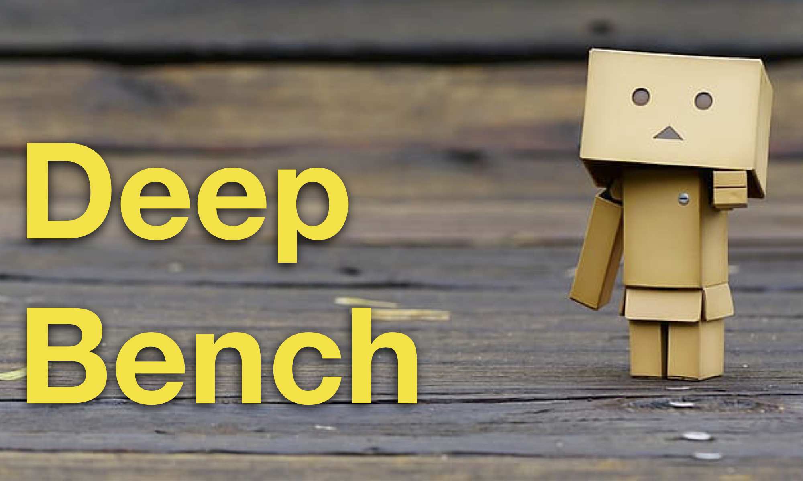
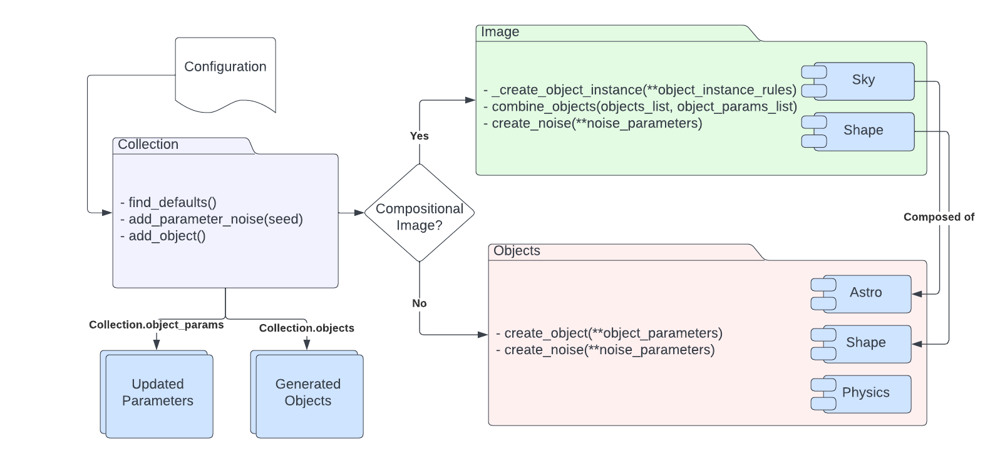

[](https://opensource.org/licenses/Apache-2.0)
 [](https://badge.fury.io/py/deepbench)




### What is it?
Simulation library for very simple simulations to *benchmark* machine learning algorithms.


### Why do we need it? Why is it useful?
1. There are very universally recognized scientifically meaningful benchmark data sets, or methods with which to generate them.
2. A very simple data set will have objects, patterns, and signals that are intuitively quanitifiable and will be fast to generate.
3. A very simple data set will be a great testing ground for new networks and for newcomers to practice with the technology.


## Requirements
* python = ">=3.8,<3.11,"
* numpy = "^1.24.3"
* matplotlib = "^3.7.1"
* scikit-image = "^0.20.0"
* astropy = "^5.2.2"
* autograd = "^1.5"
* pyyaml = "^6.0"


## Install

### From PyPi
```
pip install deepbench
```

### From Source

```
git clone https://github.com/deepskies/DeepBench.git
pip install poetry
poetry shell
poetry install
poetry run pytest --cov
```

## General Features
1. very fast to generate
2. Mimics in a very basic / toy way what is in astro images
3. Be fully controllable parametrically



### Included Simulations

1. Astronomy Objects - simple astronomical object simulation
- Galaxy, Spiral Galaxy, Star

2. Shapes - simple 2D geometric shapes
- Rectangle, Regular Polygon, Arc, Line, Ellipse

3. Physics Objects - simple physics simulations
- Neutonian Pendulum, Hamiltonian Pendulum

## Example

### Standalone
* Produce 3 instance of a pendulum over 10 different times with some level of noise.
```
import numpy as np
from deepbench.collection import Collection

configuration = {
	"object_type": "physics",
	"object_name": "Pendulum",
	"total_runs": 3,
	"parameter_noise": 0.2,
	"image_parameters": {
		"pendulum_arm_length": 2,
		"starting_angle_radians": 0.25,
		"acceleration_due_to_gravity": 9.8,
		"noise_std_percent":{
			"acceleration_due_to_gravity": 0
	},
	"object_parameters":{
		"time": np.linspace(0, 1, 10)
	}
}

phy_objects = Collection(configuration)()

objects = phy_objects.objects
parameters = phy_objects.object_parameters
```

* Produce a noisy shape image with a rectangle and an arc

```
import numpy as np
from deepbench.collection import Collection

configuration = {
	"object_type": "shape",
	"object_name": "ShapeImage",

	"total_runs": 1,
	"image_parameters": {
		"image_shape": (28, 28),
		"object_noise_level": 0.6
	},

	"object_parameters": {
		[
		"rectangle": {
			"object": {
				"width": np.random.default_rng().integers(2, 28),
				"height": np.random.default_rng().integers(2, 28),
				"fill": True
			},
			"instance": {}
		},
		"arc":{
			"object": {
				"radius": np.random.default_rng().integers(2, 28),
				"theta1":np.random.default_rng().integers(0, 20),
				"theta2":np.random.default_rng().integers(21, 180)
			},
			"instance":{}
		}

		]
	}
}

shape_image = Collection(configuration)()

objects = shape_image.objects
parameters = shape_image.object_parameters
```


### Fine-Grained Control
* Make a whole bunch of stars
```
from deepbench.astro_object import StarObject
import numpy as np

star = StarObject(
        image_dimensions = (28,28),
        noise = 0.3,
        radius= 0.8,
        amplitude = 1.0
    )

generated_stars = []
x_position, y_position = np.random.default_rng().uniform(low=1, high=27, size=(2, 50))
for x_pos, y_pos in zip(x_position, y_position):
	generated-stars.append(star.create_object(x_pos, y_pos))
```


## Contributions
### Original Team
1. Craig Brechmos
2. Renee Hlozek
3. Brian Nord

### Refactor and Deployment
1. Ashia Livaudais
2. M. Voetberg

### Pendulum Team
1. Becky Nevin
2. Omari Paul

## Contributing
[Please view the deepskies contribution guidelines before submitting a code addition](https://github.com/deepskies/.github/blob/main/CONTRIBUTING.md)

## Acknowledgement


This work was produced by Fermi Research Alliance, LLC under Contract No. DE-AC02-07CH11359 with the U.S. Department of Energy. Publisher acknowledges the U.S. Government license to provide public access under the DOE Public Access Plan DOE Public Access Plan.
Neither the United States nor the United States Department of Energy, nor any of their employees, makes any warranty, express or implied, or assumes any legal liability or responsibility for the accuracy, completeness, or usefulness of any data, apparatus, product, or process disclosed, or represents that its use would not infringe privately owned rights.

We acknowledge the Deep Skies Lab as a community of multi-domain experts and collaborators who’ve facilitated an environment of open discussion, idea-generation, and collaboration. This community was important for the development of this project.

