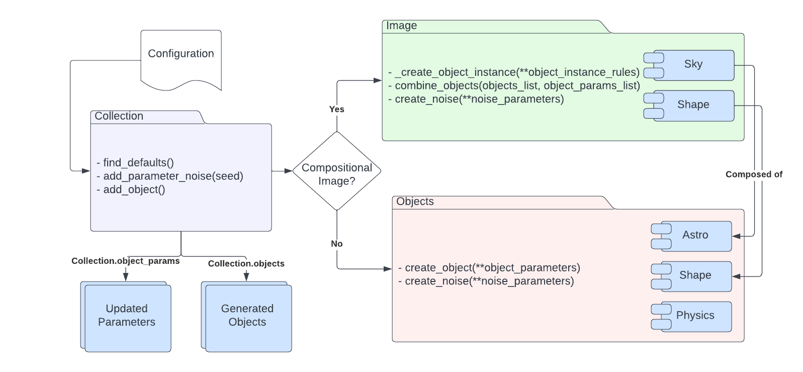

.. DeepBench documentation master file, created by
   sphinx-quickstart on Tue Jun 20 13:50:51 2023.
   You can adapt this file completely to your liking, but it should at least
   contain the root `toctree` directive.

Welcome to DeepBench's documentation!

.. image:: repository_support/DeepSkies_Logos_DeepBench.png
   :width: 800
=====================================

.. toctree::
   :maxdepth: 2
   :caption: Contents:

   collection
   image
   astro_object
   physics_object
   shapes
   example

Indices and tables
==================

* :ref:`genindex`
* :ref:`modindex`
* :ref:`search`
