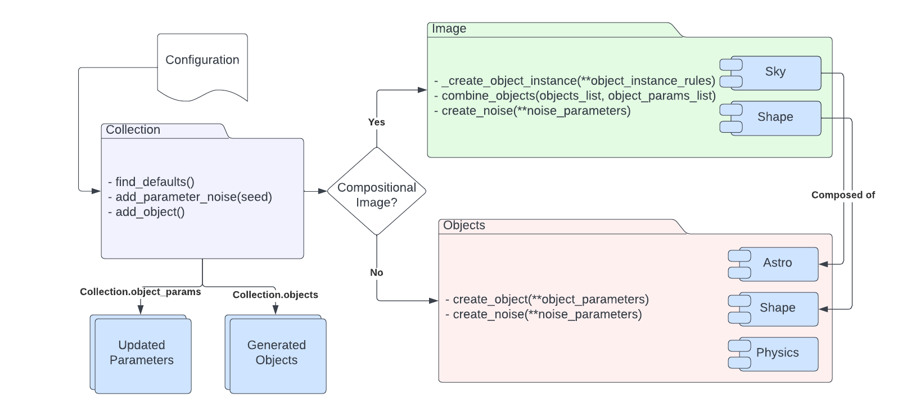
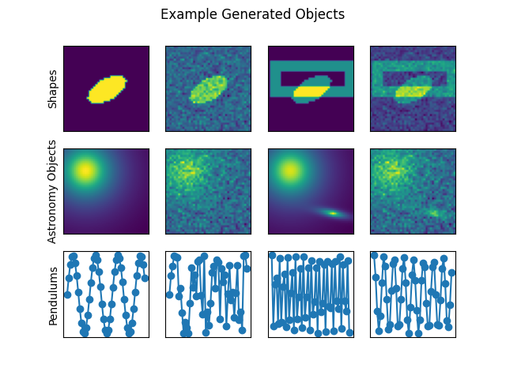

# Summary
We introduce **DeepBench**, a python library that uses first principles-based mechanistic models to generate basic simulated  data, such as geometric shapes, astronomical objects, and physics objects. These data come in the form of images or time series and can include noise, which is critical for studies for uncertainty quantification (UQ). These data are highly valuable for developing, calibrating, testing, and benchmarking statistical and machine learning models because the final data products are connected to physically principled and interpretable inputs. This software includes tools to curate and store the datasets to maximize reproducibility.

# Statement of Need

The physics community at large is experiencing a lack of mechanistic benchmark datasets tailored toward uncertainty-aware statistical and machine learning approaches.

We aim to address the following needs for model-building with simulations:

* replicability, reproducibility via metatdata tracking;
* simple objects -- simpler than most simulators -- that can be used for benchmarking and for education;
* physical or geometric objects for use in precise scientific and statistical contexts;
* robust error handling for UQ;

**DeepBench** provides  a comprehensive simulation framework, including a careful treatment of stochastic noise and centralized storage of simulation parameters and results. Therefore, it will also play a vital role in the development and testing of state-of-the-art inference methods such as Simulation Based Inference (SBI). This package equips practitioners with a streamlined toolset, which can be used to validate their techniques, which they can then apply to more complex simulations.

## Related Work

Benchmarks and simulations are heavily used in the field of Machine Learning. There many benchmark datasets based on natural images -- e.g., MNIST `[@mnist:2012]`, CIFAR `[@cifar]`, Imagenet `[@imagenet]`. Unfortunately, these kinds of images don't have a basis in a mechanistic model, and so can't be used to precisely numerically address issues related to interpretability, explainability, and UQ. There are multiple codebases to generate simulated data for astronomy -- e.g., astropy `[@astropy:2018]`, galsim `[@galsim:2015]`, lenstronomy `[@lenstronomy:2018]`, deeplenstronomy `[@deeplenstronomy]`. However, these tools for astronomy are complex and can be difficult to get up and running. The work that is most closely related the work described here is SHAPES `[@DBLP:journals/corr/WuTWSDH16]` for its use of collections of geometric objects as a benchmark with varying levels of complexity.

However, the data generation described above comes in two flavors - either highly complex but highly controllable (e.g. lenstronomy, galsim), or low complexity and low control (e.g. MNIST, SHAPES).
Both of these serve an important role, but there is a gulf between them.
Not every user who wants to work with astronomical data needs the fine grain control a simulation like lenstronomy provides, nor does every user have access to the computational resources required to do so.
On the other hand, the high accessibility and ease-of-use of most benchmark datasets make them ideal for benchmarking general image-based tasks, but most lack the highly specific primitives for scientific tasks, nor do they have the option to modify them use-case to use-case.

# Features

* Simplicity: **DeepBench** was designed with the philosophy of being easy to use for someone with minimal programming experience.
* Reproducibility: Including methods to catalog all produced images and provide a description of all generated objects for purposes of metadata tracking, use in UQ, and treatment in SBI methods.
* Diagnosis: The software is also intended for use as a diagnostic tool, for help in identifying weaknesses during model development.

When working with a difficult problem, being able to incrementally scale back the difficulty (remove noise, decrease the number of classes, increase the class balance, etc.) can be a useful tool in finding the point of difficulty when training a new architecture.  The design of **DeepBench** is such that configuration files can be generated with varying levels of complexity, making it possible to “roll back” the scale of a problem, such that possible areas of difficulty can be removed and added back in incrementally, allowing for problems to be solved one by one.

# Modules

An overview of the  **DeepBench** process.
The user writes a configuration file that contains the dataset parameters, such as the type of objects in each image, and the associated qualities of each object. This configuration file is then passed to the Collection module by the user.
These are collected and used by the Image module to call each individual object with their specified parameters, combined into one composite image, and noise, specified in the image parameters, is then applied before the image is saved. The parameters of each image is stored and saved as well.

* Geometric objects: generated with matplotlib `[@Hunter:2007]`; can be solid, filled two-dimensional shapes and may also have an outline with a varying thickness. Shapes include rectangles, _N_-sided polygons, arcs, straight lines, ellipses. Shapes are limited to two-color rendering, such that all shapes are composed of 0 and 1 values within an array. They can be combined in multiple ways using the "Image" module to produce composite images with different geometric objects and noise.
* Physics objects: Two types of pendulums are included - one using Newtonian physics, the other using Hamiltonian. Both simulations mathematically model the physics involved and introduce reproducible Gaussian noise to all parameters.
* Astronomical Objects: Astronomical objects offer simplified renderings of common light profiles found in astronomical data sets. Two-dimensional models are representations of astronomical objects commonly found in data sets used for galaxy morphology classification. All objects also come with the option to append various levels of Gaussian and Poisson noise, and are output as NumPy arrays. The Star object is created using the Moffat distribution provided by the AstroPy `[@astropy:2018]` modeling library. The Elliptical Galaxy object is created using the Sérsic profile provided by the AstroPy modelling library. The profile of the Spiral Galaxy object is created by simulating the function used to produce a logarithmic spiral `[@Ringermacher_2009]`
* Image: Allows users to concatenate various shape or astronomical objects within a matplotlib meshgrid object in order to simulate the profiles and shape distributions commonly seen in images used in more complex astronomical data sets. Two distinct image types are available - sky images and geometric (shape) images. Sky images are composed of any combination of user-specified galaxy and star objects, while geometric images are canvased assortments of any of the individual geometric shape objects available.
* Collection: Provides a framework for producing module images or objects at once and storing all parameters that were included in their generation, including exact noise levels, object hyper-parameters, and non-specified defaults.

# Example Output

Example outputs of **DeepBench**, containing shapes, astronomy objects, and the two pendulum flavors. Variants include a single object, a noisy single object, two objects, and two noisy objects.

Pendulums show noisy and non-noisy variants of the Newtonian (left) and Hamiltonian (right) mathematical simulations.

# Acknowledgements

*M. Voetberg*: Conceptualization, methodology, software, writing, project administration. *Ashia Livaudais*: Conceptualization, methodology, software, writing, project administration. *Becky Nevin*: Software, project administration. *Omari Paul*: Software. *Brian Nord*: Conceptualization, project administration, funding acquisition, supervision, writing.

We acknowledge contributions from Alex Ciprijanovic, Renee Hlozek, Craig Brechmos.

Work supported by the Fermi National Accelerator Laboratory, managed and operated by Fermi Research Alliance, LLC under Contract No. DE-AC02-07CH11359 with the U.S. Department of Energy. The U.S. Government retains and the publisher, by accepting the article for publication, acknowledges that the U.S. Government retains a non-exclusive, paid-up, irrevocable, world-wide license to publish or reproduce the published form of this manuscript, or allow others to do so, for U.S. Government purposes.

We acknowledge the Deep Skies Lab as a community of multi-domain experts and collaborators who have facilitated an environment of open discussion, idea-generation, and collaboration. This community was important for the development of this project.

`FERMILAB-FN-1231-CSAID`

# References

