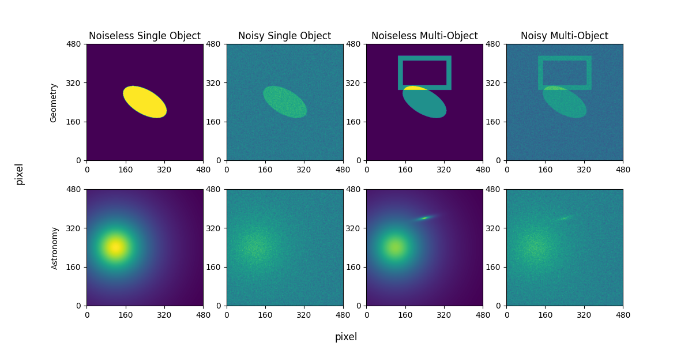
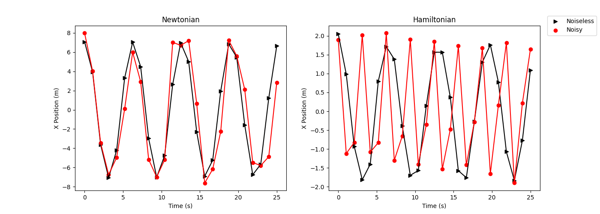

# Summary
We introduce **DeepBench**, a Python library that employs mechanistic models (i.e., analytic mathematical models) to simulate data that represent physics-related objects and systems: geometric shapes (e.g., polygon), physics objects (e.g., pendulum), and astronomical objects (e.g., elliptical galaxy). These data take the form of images (two-dimensional) or time series (one-dimensional). In contrast to natural image benchmarks and complex physics simulations, these data have simple, direct, numerical, and traceable connections between the input data and the label data. When seeking a quantifiable interpretation, this kind of data is uniquely suitable for developing, calibrating, testing, and benchmarking statistical and machine learning models. Finally, this software package includes methods to curate and store these datasets to maximize reproducibility.

# Statement of Need
There are multiple open problems and issues that are critical for the machine learning and scientific communities to address; principally: interpretability, explainability, uncertainty quantification, and inductive bias in machine learning models when they are applied to scientific data. Multiple kinds of datasets and data simulation software packages can be used for developing models and confronting these challenges. These datasets range from natural images and text to multi-dimensional data of physical processes. Indeed, multiple benchmark data and simulation software packages have been created for developing and comparing models.

However, these benchmarks are typically limited in significant ways. Natural image datasets comprising images from the real or natural world (e.g., vehicles, animals, landscapes) are widely used in the development of machine learning models. These kinds of datasets tend to be large, diverse, and carefully curated. However, they are not underpinned by or constructed upon physical principles: they cannot be generated by mathematical expressions of formal physical theory, so there is not a robust connection between the data and a quantitative theory. Therefore, these datasets have a severely limited capacity to help address many questions in machine learning models, such as uncertainty quantification.

On the other hand, complex physics simulations (e.g., cosmological _N_-body simulations and particle physics simulators) are accurate, detailed, and based on precise quantitative theories and models. This facilitates studies of interpretability and uncertainty quantification because there is the possibility of linking the simulated data to the input choices through each layer of calculation in the simulator. However, they are relatively small in size and number, and they are computationally expensive to reproduce. In addition, while they are underpinned by specific physical functions, the complexity of the calculations makes them challenging as a venue through which to make connections between machine learning results and input choices. Complex physics simulations have one or more layers of mechanistic models. Mechanistic models are defined with analytic functions and equations that describe and express components of a given physical process: these are based on theory and empirical observations. In both of these scenarios, it is difficult to build interpretable models that connect raw data and labels, and it is difficult to generate new data rapidly.

The physical sciences community lacks sufficient datasets and software packages as benchmarks for the development of statistical and machine learning models.  In particular, there currently does not exist simulation software packages that generates data underpinned by physical principles and that satisfies the following criteria:

* multi-domain 
* multi-purpose
* fast
* reproducible
* extensible
* based on mechanistic models
* include detailed noise prescriptions.

## Related Work

There are many benchmarks---both datasets and simulation software packages---widely used for model building in machine learning, statistics, and the physical sciences. 
First, benchmark datasets of natural images include MNIST [@dengMnistDatabaseHandwritten2012c], CIFAR-10 [@krizhevskyCIFAR10CanadianInstitute2017a], and ImageNet [@russakovskyImageNetLargeScale2015a]. Second, there are several large astronomical observation datasets, such as the CfA Redshift Survey [@huchraSurveyGalaxyRedshifts1983], Sloan Digital Sky Survey [@yorkSloanDigitalSky2000], and Dark Energy Survey [@abbottDARKENERGYSURVEY]. Third, many _N_-body cosmology simulation datasets serve as benchmarks, such as the Millennium [@springelCosmologicalSimulationCode2005], Illustris [@vogelsbergerIntroducingIllustrisProject2014b], EAGLE [@schayeEAGLEProjectSimulating2015], Coyote [@heitmannCoyoteUniversePrecision2010], Bolshoi [@klypinDARKMATTERHALOS2011], CAMELS [@villaescusa-navarroCAMELSProjectCosmology2021], and Quijote [@villaescusa-navarroQuijoteSimulations2020] projects. Fourth, there have been multiple astronomy dataset challenges that can be considered benchmarks for analysis comparison: e.g., PLAsTiCC [@hlozekResultsPhotometricLSST2020a], The Great08 Challenge [@bridleHandbookGREAT08Challenge2009a], and the Strong Gravitational Lens Challenge [@metcalfStrongGravitationalLens2019c].  Fifth, there are multiple software packages that generate simulated data for astronomy and cosmology, such as Astropy [@theastropycollaborationAstropyCommunityPython2013a], GalSim [@roweGalSimModularGalaxy2015], `lenstronomy` [@birrerLenstronomyMultipurposeGravitational2018a], `deeplenstronomy` [@morganDeeplenstronomyDatasetSimulation2021a], CAMB [@lewisEfficientComputationCMB2000], pixell [@WelcomePixellDocumentation], and SOXS [@SOXSSimulatedObservations]. Finally, particle physics projects use standard codebases for simulations, such as Geant4 [@piaGeant4ScientificLiterature2009], GENIE [@andreopoulosGENIENeutrinoMonte2015], and PYTHIA [@sjostrandPYTHIAEventGenerator2020]. These simulations span wide ranges in speed, code complexity, physical fidelity, and detail. Unfortunately, these datasets and software packages lack a combination of critical features, including mechanistic models, speed, and reproducibility, which are needed for more fundamental studies of statistical and machine learning models. The work in this paper is most closely related to SHAPES [@wuVisualQuestionAnswering2016a] because that work also uses collections of geometric objects with varying levels of complexity as a benchmark.

# DeepBench

The **DeepBench** software package simulates data for analysis tasks that require precise numerical calculations. First, the simulation models are fundamentally mechanistic: they are based on relatively simple analytic mathematical expressions, which are physically meaningful. This means that for each model, the number of input parameters that determine a simulation output is small (<10 for most models). These elements make the software package fast and the outputs interpretable: they are conceptually and mathematically relatable to the inputs. Second, **DeepBench** also includes methods to precisely prescribe noise for inputs, which are propagated to outputs. This permits studies and the development of statistical inference models that require uncertainty quantification, which is a significant challenge in modern machine learning research. Third, the software framework includes features that permit a high degree of reproducibility: e.g., random seeds at every key stage of input, a unique identification tag for each simulation run, and the tracking and storage of metadata (including input parameters) and the related outputs. Fourth, the primary user interface is a YAML configuration file, which allows the user to specify every aspect of the simulation: e.g., types of objects, numbers of objects, noise type, and number of classes. This feature---which is especially useful when building and studying complex models like deep learning neural networks---permits the user to incrementally decrease or increase the complexity of the simulation with a high level of granularity.

**DeepBench** has the following features:

* Exact reproducibility
* Noise and error propagation
* Mechanistic modeling
* Physical sciences-based modeling
* Computational efficiency
* Simulations relevant to multiple domains
* Outputs of varying dimensions
* Readily extensible to new physics and outputs

# Primary Modules 

* Geometry objects: two-dimensional images generated with `matplotlib` [@hunterMatplotlib2DGraphics2007b]. The shapes include _n_-sided polygons, arcs, straight lines, and ellipses. They are solid, filled, or unfilled two-dimensional shapes with edges of variable thickness.  
* Physics objects: one-dimensional profiles for two types of implementations of pendulum dynamics: one using Newtonian physics, the other using Hamiltonian physics.
* Astronomy objects: two-dimensional images generated based on radial profiles of typical astronomical objects. The star object is created using the Moffat distribution provided by the Astropy [@theastropycollaborationAstropyCommunityPython2013a] library. The spiral galaxy object is created with the function used to produce a logarithmic spiral [@ringermacherNewFormulaDescribing2009a]. The elliptical galaxy object is created using the Sérsic profile provided by the Astropy library. Two-dimensional models are representations of astronomical objects commonly found in datasets used for galaxy morphology classification. 
* Image: two-dimensional images  that are combinations and/or concatenations of geometry or astronomy objects. The combined images are stored within `matplotlib` meshgrid objects. Sky images are composed of any combination of astronomy objects, while geometric images comprise individual geometric shape objects. 
* Collection: provides a framework for producing module images or objects at once and storing all parameters that were included in their generation, including exact noise levels, object hyper-parameters, and non-specified defaults. 

All objects also come with the option to add noise to each object. For physics objects---i.e., the pendulum---the user may add Gaussian noise to parameters: initial angle $\theta_0$, the pendulum length $L$, the gravitational acceleration $g$, the planet properties $\Phi = (M/r^2)$, and Newton's gravity constant $G$. Note that $g = G * \Phi = G * M/r^2$: all parameters in this relationship can receive noise. For astronomy and geometry Objects, which are images, the user can add Poisson or Gaussian noise to the output images. Finally, the user can regenerate the same noise using the saved random seed.

# Example Outputs 

# Acknowledgments

*M. Voetberg*: conceptualization, methodology, software, writing, project administration. *Ashia Livaudais*: conceptualization, methodology, software, writing, project administration. *Becky Nevin*: software, project administration. *Omari Paul*: software. *Brian Nord*: conceptualization, methodology, project administration, funding acquisition, supervision, writing.

We acknowledge contributions from Alex Ćiprijanović, Renee Hlozek, Craig Brechmos.

Work supported by the Fermi National Accelerator Laboratory, managed and operated by Fermi Research Alliance, LLC under Contract No. DE-AC02-07CH11359 with the U.S. Department of Energy. The U.S. Government retains and the publisher, by accepting the article for publication, acknowledges that the U.S. Government retains a non-exclusive, paid-up, irrevocable, world-wide license to publish or reproduce the published form of this manuscript, or allow others to do so, for U.S. Government purposes.

We acknowledge the Deep Skies Lab as a community of multi-domain experts and collaborators who have facilitated an environment of open discussion, idea-generation, and collaboration. This community was important for the development of this project.

# References

